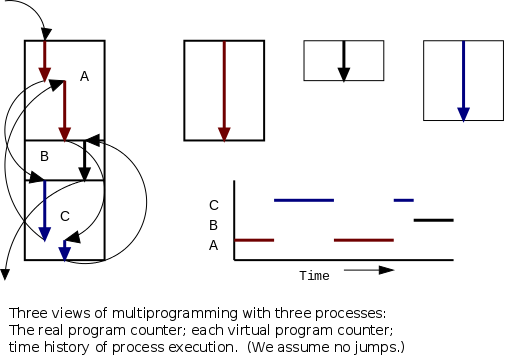
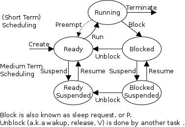

# Operating Systems Scheduler

By Jason Yao, [github](https://github.com/JasonYao/Operating-Systems-Process-Scheduler)

## Information For The Grader

To run this program, please make sure that the random number file provided is in the same directory that it is being run in, and that the random number file
is called `random-numbers`.

To compile:

`gcc scheduler.c -o scheduler`

To run:

	`./scheduler <flag_1> <flag_2> <input_filename>`

	E.g.: Normal

		`./scheduler testing/input/input-1`

	E.g.: With random number output only

		`./scheduler --random testing/input/input-1`

	E.g.: With both verbose and random number output

		`./scheduler --verbose --random testing/input/input-1`

## Description

Processes are defined as a program in execution. Process scheduling occurs when a process manager utilises
time multiplexing in order to *simulate* parallel computation (NOTE: this is **NOT** true parallelism, which occurs when the system has more than one processor).
This is sometimes known as pseudo-parallelism due to the illusion from the user's perspective that the OS is running on more than a single processor.

Process scheduling is an essential part of a Multiprogramming operating system. Such operating systems allow more than one process to be loaded 
into the executable memory at a time, allowing processes to share the CPU via time multiplexing. The benefits of time multiplexing should be obvious, 
with the largest benefit simply that the operating system does not need to stall until a process is complete, but can actually work on multiple jobs 
in piecemeal, processing them a little at a time.

This scheduler in particular reads in processes, in the `ABCM` format, such that each process contains the values which represent:

- `A`: The arrival time of the process

- `B`: The upperbound on the CPU burst times (given in a list of uniformly distributed random integers (UDRIs) in the interval (0, B])

- `C`: The total CPU time required

- `M`: The multiplier for the I/O burst time (I/O burst time = preceding CPU burst time * M)

### Different Scheduling Algorithms

This program will simulate four different scheduling algorithms, assuming for simplicity that a context switch takes 0 time. These scheduling algorithms are:

- `FCFS`: `First Come First Serve`, a non-pre-emptive algorithm, so that the currently running process continues until termination or blocking.

	- [NOTE]: Process can 'hog' the processor, disallowing other processes from running.

- `RR`: `Round Robin`, which is FCFS with preemption.

	- [NOTE]: Gets rid of the 'hogging issue' from classical `FCFS`, though requires a `quantum` value.

		- [Quantum Values]: For extreme fairness, let the quantum = 1, though that results in the cost of context switching to take up more than 99.9% of the CPU (VERY, VERY BAD).

		- [Quantum Values]: For 'reasonable fairness', let the quantum = 1ms on a system with 1 GiB instructions/second, and 1M instructions, resulting in 1/1,000,000 CPU time lost in context switching.

		- [Quantum Values]: Let quantum for all process = ∞, which will result in no pre-emption, and thus turns into classical `FCFS`.

- `Uniprogrammed`: Pretty self-explanatory, there is only one process active at any time- when the process is blocked, the system stalls (waits). Is **NON**-preemptive by definition.

- `SJF`: `Shortest Job First`, a **NON**-preemptive algorithm **BUT** switch upon blocking (i.e. I/O bursts)

	- [NOTE]: In this case, priority will be determined by the total remaining time (the process's `C` value - the current number of cycles this process has run).

### Preemptive versus non-preemptive scheduling algorithms:

- Preemption means the operating system sometimes moves a process from running to ready without the process requesting it.

- Without preemption, the system implements "run until completion, or block, or yield, if there is threading".

- The "preempt" arc in the diagram is present for preemptive scheduling algorithms.

- We do not emphasize yield (a solid arrow from running to ready).

- Preemption needs a clock interrupt (or equivalent).

- Preemption is needed to guarantee fairness.

- Preemption is found in all modern general purpose operating systems.

- Even non-preemptive systems can be multiprogrammed (remember that processes do block for I/O).

- Preemption is expensive.

## Usage and Setting Flags

It should be noted that this scheduler can be run with multiple flags, depending on the level of detail/verbosity the user would like. In particular:

`--verbose` will output the state and remaining burst for each process.

`--random` will output the random number printed each time.

The flags may be input in any order before the file input name, and the program may be run in the following format:

`./scheduler <flag_1> <flag_2> <input_filename>`

E.g.: Normal

`./scheduler testing/input/input-1`

E.g.: With random number output

`./scheduler --random testing/input/input-1`

E.g.: With both verbose and random number output

`./scheduler --verbose --random testing/input/input-1`

## License
This repo is licensed as described in the [license file](LICENSE.md).
